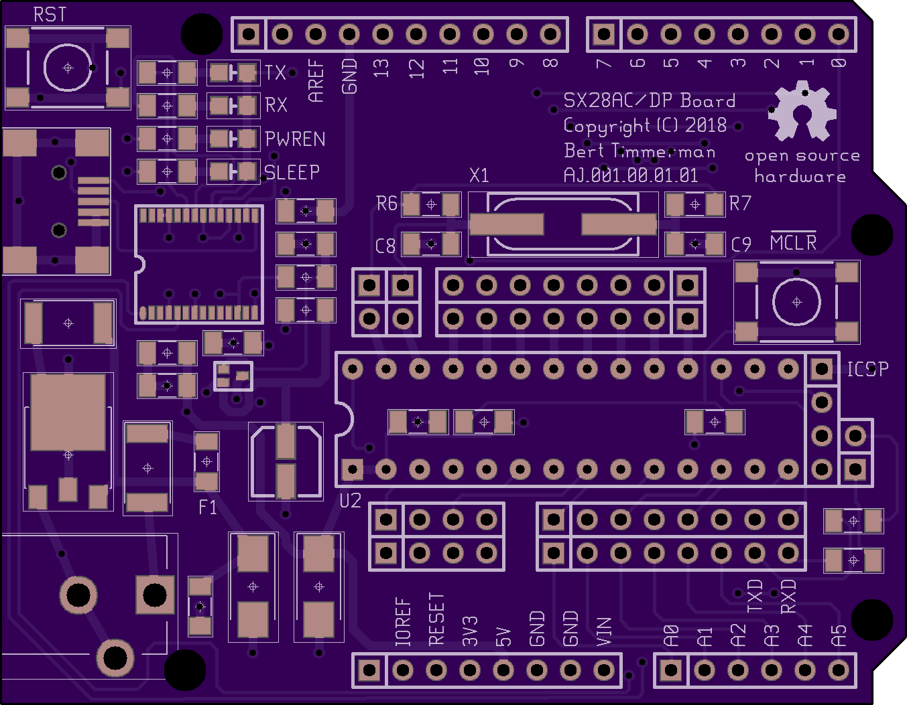
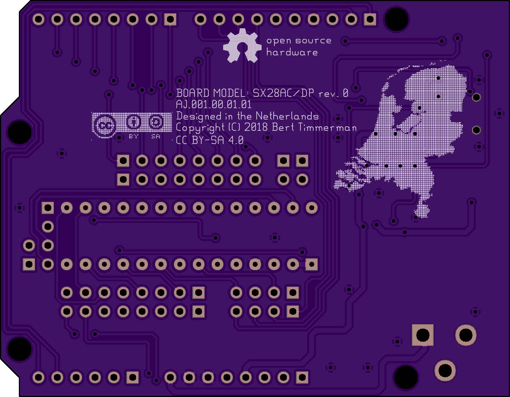
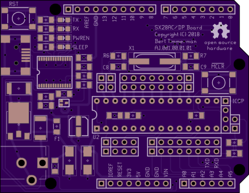
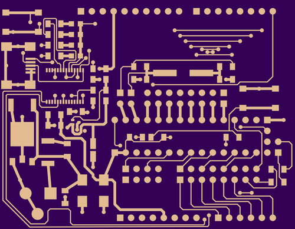
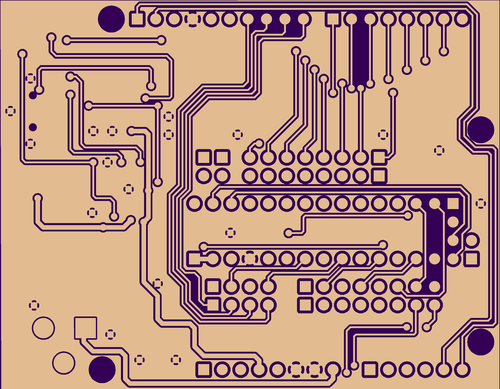
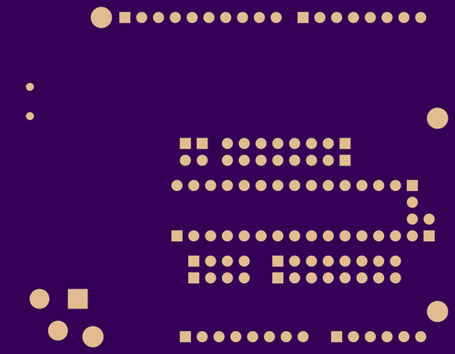
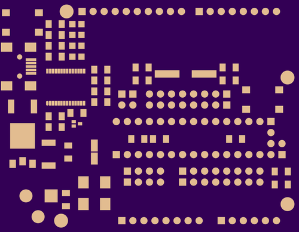
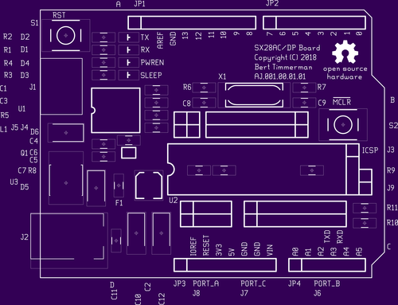

# AJ.001.00.01.01

Top.

Bottom.

2 layer board of 2.71 x 2.11 inches (68.8 x 53.5mm) 

Uploaded: September 15th, 2018

Total price: $ 28.50 (3 pieces)

# SX28AC/DP board

This board has an Arduino UNO R3 form factor and should be compatible
with most Arduino shields.

## Bill Of Materials

refdes | value      | mfg        | mfg_PN                 | vendor     | vendor_PN                                                 | remarks
-------|------------|------------|------------------------|------------|-----------------------------------------------------------|--------
C1     | 10nF       | Kemet      | C1206C103K5RACTU       | Conrad     | [458111](https://www.conrad.com/ce/en/product/458111)     |
C2     | 4.7uF/35V  | Nichicon   | UWD1V4R7MCL1GS         | Conrad     | [404647](https://www.conrad.com/ce/en/product/404647)     |
C3     | 100nF      | Kemet      | C1206C104K1RACTU       | Conrad     | [458125](https://www.conrad.com/ce/en/product/458125)     |
C4     | 100nF      | Kemet      | C1206C104K1RACTU       | Conrad     | [458125](https://www.conrad.com/ce/en/product/458125)     |
C5     | 100nF      | Kemet      | C1206C104K1RACTU       | Conrad     | [458125](https://www.conrad.com/ce/en/product/458125)     |
C6     | 100nF      | Kemet      | C1206C104K1RACTU       | Conrad     | [458125](https://www.conrad.com/ce/en/product/458125)     |
C7     | 100nF      | Kemet      | C1206C104K1RACTU       | Conrad     | [458125](https://www.conrad.com/ce/en/product/458125)     |
C8     | 15pF       | Kemet      | C0805C150J5GACTU       | Conrad     | [457991](https://www.conrad.com/ce/en/product/457991)     |
C9     | 15pF       | Kemet      | C0805C150J5GACTU       | Conrad     | [457991](https://www.conrad.com/ce/en/product/457991)     |
C10    | 10uF/25V   | Kemet      | T491C106K025AT         | Conrad     | [458351](https://www.conrad.com/ce/en/product/458351)     |
C11    | 100nF      | Kemet      | C1206C104K1RACTU       | Conrad     | [458125](https://www.conrad.com/ce/en/product/458125)     |
C12    | 10uF/25V   | Kemet      | T491C106K025AT         | Conrad     | [458351](https://www.conrad.com/ce/en/product/458351)     |
D1     | Yellow     | Osram      | LYR976                 | Conrad     | [819967](https://www.conrad.com/ce/en/product/819967)     |
D2     | Yellow     | Osram      | LYR976                 | Conrad     | [819967](https://www.conrad.com/ce/en/product/819967)     |
D3     | Red        | Osram      | LHR974                 | Conrad     | [819938](https://www.conrad.com/ce/en/product/819938)     |
D4     | Green      | Osram      | LGR971                 | Conrad     | [819934](https://www.conrad.com/ce/en/product/819934)     |
D5     | SUF4002    | Diotec     | SUF4002                | Conrad     | [556848](https://www.conrad.com/ce/en/product/556848)     |
D6     | SUF4002    | Diotec     | SUF4002                | Conrad     | [556848](https://www.conrad.com/ce/en/product/556848)     |
F1     | It=500mA   | Littlefuse | 1206L025YR             | Digi-Key   | [F2110CT-ND](https://www.digikey.nl/product-detail/en/littelfuse-inc/1206L025YR/F2110CT-ND/455719) |
J1     | 2486-01    | Lumberg    | 2486-01                | Conrad     | [738560](https://www.conrad.com/ce/en/product/738560)     |
J2     | 18742      | 4UCON      | 18742                  | iPrototype |  |
J3     | SIL 4p     | MPE Garry  | 087-1-004-0-S-XS0-1260 | Conrad     | [733940](https://www.conrad.com/ce/en/product/733940)     |
J4     | SIL 2p     | MPE Garry  | 087-1-002-0-S-XS0-1260 | Conrad     | [733900](https://www.conrad.com/ce/en/product/733900)     |
J5     | SIL 2p     | MPE Garry  | 087-1-002-0-S-XS0-1260 | Conrad     | [733900](https://www.conrad.com/ce/en/product/733900)     |
J6     | SIL 8p     | MPE Garry  | 087-1-008-0-S-XS0-1260 | Conrad     | [734023](https://www.conrad.com/ce/en/product/734023)     |
J7     | SIL 8p     | MPE Garry  | 087-1-008-0-S-XS0-1260 | Conrad     | [734023](https://www.conrad.com/ce/en/product/734023)     |
J8     | SIL 4p     | MPE Garry  | 087-1-004-0-S-XS0-1260 | Conrad     | [733940](https://www.conrad.com/ce/en/product/733940)     |
J9     | SIL 2p     | MPE Garry  | 087-1-002-0-S-XS0-1260 | Conrad     | [733900](https://www.conrad.com/ce/en/product/733900)     |
JP1    | SIL 10p    |            |                        | Sparkfun   | [PRT-11417](https://www.sparkfun.com/products/11417)      |
JP2    | SIL 8p     |            |                        | Sparkfun   | [PRT-11417](https://www.sparkfun.com/products/11417)      |
JP3    | SIL 8p     |            |                        | Sparkfun   | [PRT-11417](https://www.sparkfun.com/products/11417)      |
JP4    | SIL 6p     |            |                        | Sparkfun   | [PRT-11417](https://www.sparkfun.com/products/11417)      |
L1     | 600@100MHz | Murata     | BLM31PG601SN1L         | Digi-Key   | [490-1057-1-ND](https://www.digikey.nl/product-detail/en/murata-electronics-north-america/BLM31PG601SN1L/490-1057-1-ND/584503) |
PORT_A | SIL 4p     | MPE Garry  | 087-1-004-0-S-XS0-1260 | Conrad     | [733940](https://www.conrad.com/ce/en/product/733940)     |
PORT_B | SIL 8p     | MPE Garry  | 087-1-008-0-S-XS0-1260 | Conrad     | [734023](https://www.conrad.com/ce/en/product/734023)     |
PORT_C | SIL 8p     | MPE Garry  | 087-1-008-0-S-XS0-1260 | Conrad     | [734023](https://www.conrad.com/ce/en/product/734023)     |
Q1     | FET 200mA  | Rohm       | RZE002P02TL            | Digi-Key   | [RZE002P02TLCT-ND](https://www.digikey.nl/product-detail/en/rohm-semiconductor/RZE002P02TL/RZE002P02TLCT-ND/2179721) |
R1     | 270        | Yageo      | RC1206JR-07270RL       | Conrad     | [402478](https://www.conrad.com/ce/en/product/402478)     | 
R2     | 270        | Yageo      | RC1206JR-07270RL       | Conrad     | [402478](https://www.conrad.com/ce/en/product/402478)     |
R3     | 270        | Yageo      | RC1206JR-07270RL       | Conrad     | [402478](https://www.conrad.com/ce/en/product/402478)     |
R4     | 270        | Yageo      | RC1206JR-07270RL       | Conrad     | [402478](https://www.conrad.com/ce/en/product/402478)     |
R5     | 1k         | Yageo      | RC1206FR-071KL         | Conrad     | [402540](https://www.conrad.com/ce/en/product/402540)     |
R6     | 1M         | Yageo      | RC1206JR-071ML         | Conrad     | [402907](https://www.conrad.com/ce/en/product/402907)     |
R7     | 0          | Yageo      | RC1206JR-070RL         | Conrad     | [402222](https://www.conrad.com/ce/en/product/402222)     |
R8     | 10k        | Yageo      | RC1206JR-0710KL        | Conrad     | [402664](https://www.conrad.com/ce/en/product/402664)     |
R9     | 1k         | Yageo      | RC1206FR-071KL         | Conrad     | [402540](https://www.conrad.com/ce/en/product/402540)     |
R10    | 150        | Yageo      | RC1206JR-07150RL       | Conrad     | [402443](https://www.conrad.com/ce/en/product/402443)     |
R11    | 150        | Yageo      | RC1206JR-07150RL       | Conrad     | [402443](https://www.conrad.com/ce/en/product/402443)     |
S1     | NO         |            | YST-1102S              | Conrad     | [1386949](https://www.conrad.com/ce/en/product/1386949)   |
S2     | NO         |            | YST-1102S              | Conrad     | [1386949](https://www.conrad.com/ce/en/product/1386949)   |
U1     | FT232RL    | FTDI       | FT232RL                | Digi-Key   | [768-1306-ND](https://www.digikey.nl/product-detail/en/ftdi-future-technology-devices-international-ltd/FT232RL-TUBE/768-1306-ND/4006920) |
U2     | SX28AC/DP  | Parallax   | SX28AC/DP-G            |            | EOLT | hard to find
U2     | 28-300     | MPE Garry  | 001-2-028-3-B1STF-XT0  | Conrad     | [179994](https://www.conrad.com/ce/en/product/179994)     |
U3     | LM1117/5V  | TI         | LM1117IDT-N-5.0/NOPB   | Conrad     | [00126859](https://www.conrad.com/ce/en/product/00126859) |
X1     | 50 MHz     | Citizen    | HCM4950000000ABJT      | Digi-Key   | [300-6160-1-ND](https://www.digikey.nl/product-detail/en/citizen-finedevice-co-ltd/HCM4950000000ABJT/300-6160-1-ND/284368) | 18 pF

## Verify your design

## Board Top

This shows the final manufactured board as if you held it in your hand.

Your design should show gold copper, purple mask, white silk, black
drills, and the board outline.

Internal cutouts are indicated by a black outline but are not filled in.

If the image here is entirely white, you'll want to find and fix any
gaps in the board outline.

There should be no dimension or measurement ruler

## Board Bottom

This shows the final manufactured board as if you held it in your hand.

Your design should show gold copper, purple mask, white silk, black
drills, and the board outline.

Internal cutouts are indicated by a black outline but are not filled in.

If the image here is entirely white, you'll want to find and fix any
gaps in the board outline.

There should be no dimension or measurement ruler

## Drills

Rendered from "AJ.001.00.01.01.XLN" , "AJ.001.00.01.01.TXT"

Drills should show up as white circles on a purple background.

We want a single merged drill file exported in Excellon or NC Drills
format with 2:4 precision, absolute coordinates, and no zero suppression.

We will merge multiple drill files into one file and only plate the
holes which pass through copper.

Drills smaller than our minimums will be increased to the minimum size,
see the [design rules](http://docs.oshpark.com/submitting-orders/drill-specs/).

- No overlapping drill hits.

- No blind or buried vias.

- Small slots and plated slots are not supported. See our [slots page](http://docs.oshpark.com/troubleshooting/cutouts-and-slots/).

- No oval or other non-circular drills.

We have more info on our [drills help page](http://docs.oshpark.com/submitting-orders/drill-specs/).

## Top Layer

Rendered from "AJ.001.00.01.01.GTL"

We will place copper everywhere we see gold color on this layer.

If you are using Altium Designer or Altium CircuitMaker, carefully
examine the board to make sure there are no shorts from the mechanical
layers being included on this layer.

See [here](http://docs.oshpark.com/design-tools/altium-designer/) for
more.

If you are using Eagle, be aware that airwires are not the same as
routed traces.

If there are no copper links between pads showing on this layer, please
review your .brd file for airwires.

See our [design tools](http://docs.oshpark.com/design-tools/) pages for
more.

## Bottom Layer

Rendered from "AJ.001.00.01.01.GBL"

This layer should appear 'mirrored' as if you were looking down on it
through the board from the top.

We will place copper everywhere we see gold color on this layer.

If you are using Altium Designer or Altium CircuitMaker, carefully
examine the board to make sure there are no shorts from the mechanical
layers being included on this layer.

See [here](http://docs.oshpark.com/design-tools/altium-designer/) for
more.

If you are using Eagle, be aware that airwires are not the same as
routed traces.

If there are no copper links between pads showing on this layer, please
review your .brd file for airwires.

See our [design tools](http://docs.oshpark.com/design-tools/) pages for
more.

## Bottom Solder Mask

Rendered from "AJ.001.00.01.01.GBS"

This layer should appear 'mirrored' as if you were looking down on it
through the board from the top.

Soldermask layers show us where to remove the purple solder resist.

The gold-colored areas will be exposed on the final board, and purple
areas will be covered.

If you submitted an empty file, we won't remove any mask so this entire
side of the board will be covered in purple soldermask

To expose the entire board, submit this file with a single polygon that
covers the entire board.

We will remove all mask everywhere and expose all the copper and board
substrate.

## Top Solder Mask

Rendered from "AJ.001.00.01.01.GTS"

Soldermask layers show us where to remove the purple solder resist.

The gold-colored areas will be exposed on the final board, and purple
areas will be covered.

If you submitted an empty file, we won't remove any mask so this entire
side of the board will be covered in purple soldermask

To expose the entire board, submit this file with a single polygon that
covers the entire board.

We will remove all mask everywhere and expose all the copper and board
substrate.

## Top Silk Screen

Rendered from "AJ.001.00.01.01.GTO"

We will ignore the portion of the silkscreen that extends beyond the
board outline.

We will automatically remove any silkscreen that crosses drilled holes
or exposed copper.

If a logo isn't showing up on this layer, try changing your design tool
import settings to create that silk image with 400 DPI or less, or check
out our Eagle-specific [import-bmp script instructions](http://docs.oshpark.com/submitting-orders/import-bmp/).

## Board Outline

Rendered from "AJ.001.00.01.01.GKO"

The board outline should be a watertight (no gaps) purple outline
showing at least the edge of the board with no gaps.

The outline layer can also show large drill holes and cutouts.

See the [outline instructions](http://docs.oshpark.com/submitting-orders/board-outline/)
for more.

We can cut non-rectangular board shapes, but you'll be billed for the
smallest rectangle to encompass the design.

A circular board with a two-inch diameter would cost the same as a
square of four square inches.

We don't offically support cutouts or plated slots, but they usually
come out okay if you follow the [cutouts and slots](http://docs.oshpark.com/submitting-orders/cutouts-and-slots/)
instructions.

